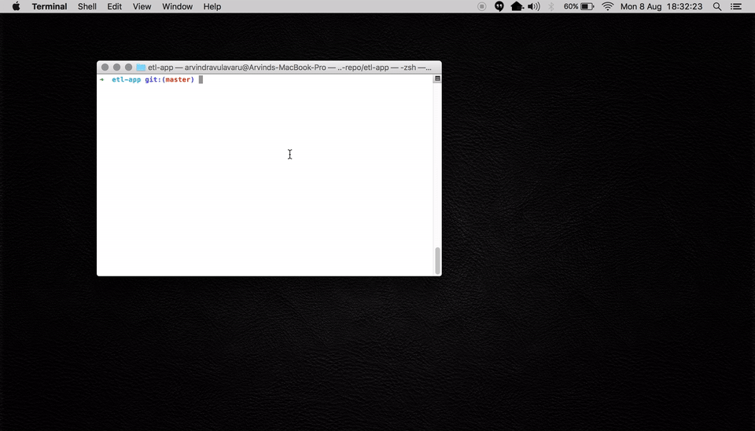
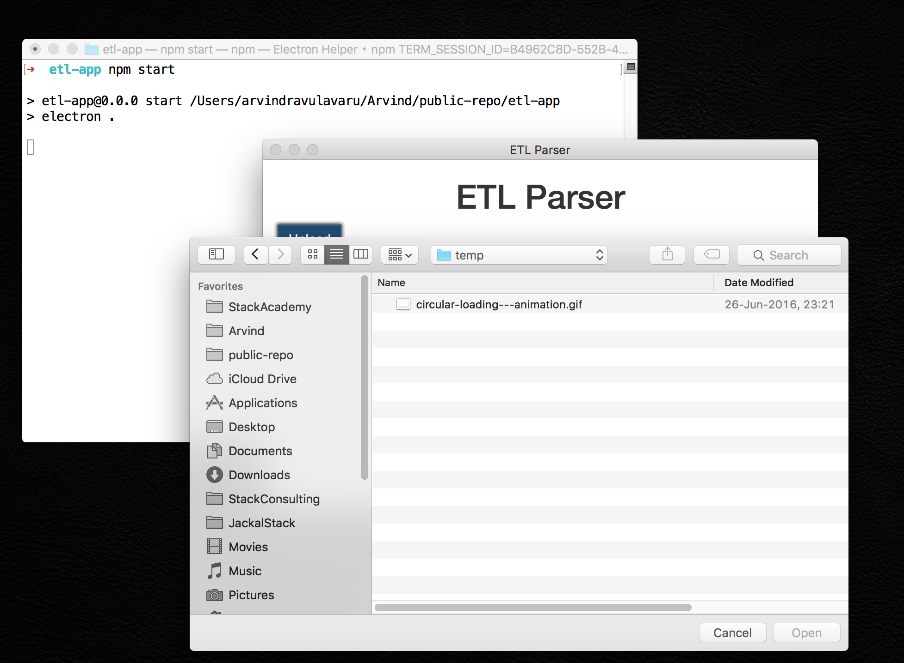
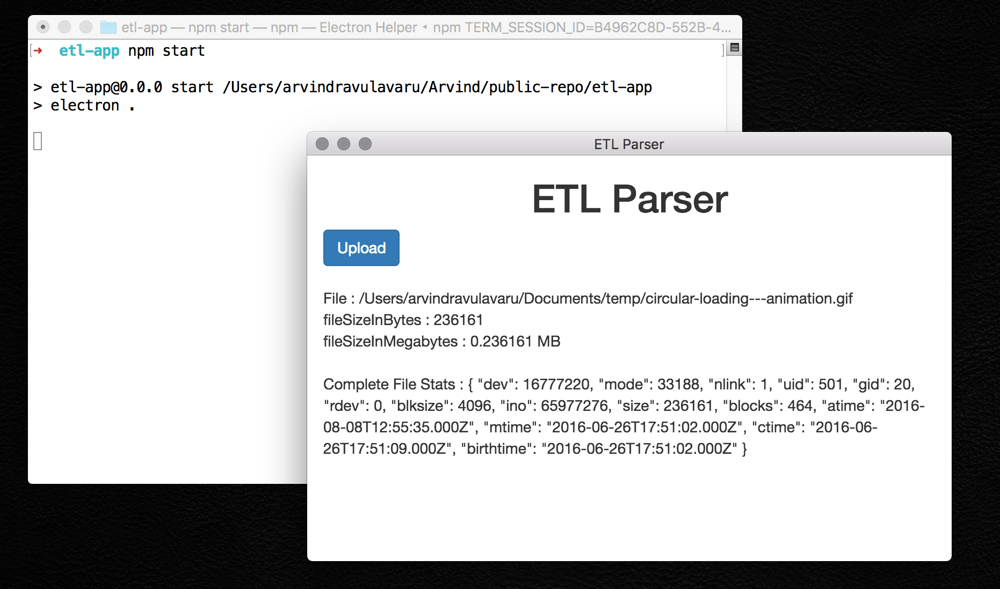

# etl-app

> ETL App

A simple ETL App that will take a file reads its stats and display in the UI.






## Dev

```
$ npm install
```

### Run

```
$ npm start
```

### Build

```
$ npm run build
```

Builds the app for OS X, Linux, and Windows, using [electron-packager](https://github.com/electron-userland/electron-packager).


## License

MIT © [Arvind Ravulavaru](http://thejackalofjavascript.com)
